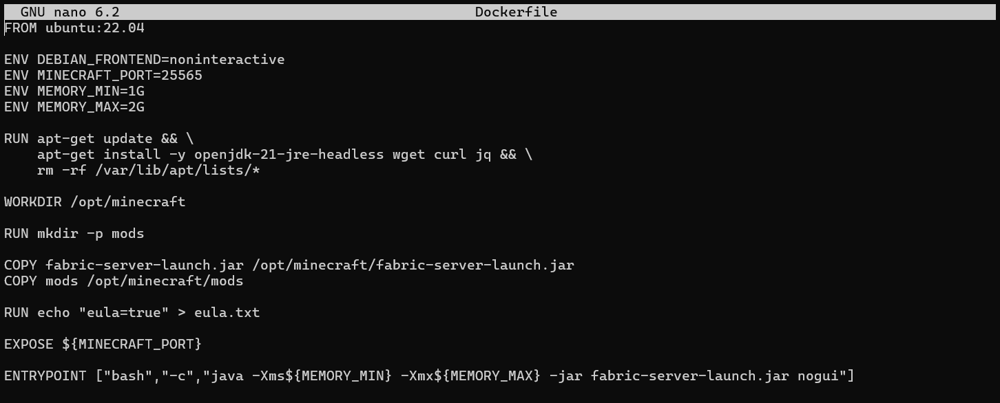
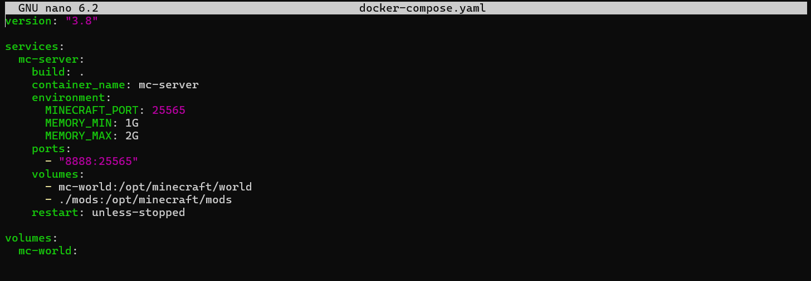

# Minecraft Docker Server

This repository contains a fully dockerized Minecraft Java Edition server.
The project is designed to run a Minecraft server inside a Docker container **without using any pre-built Minecraft images**, fulfilling all requirements o>

## Table of Contents

1. [Features](#1-features)
2. [Prerequisites](#2-prerequisites)
3. [Quickstart](#3-quickstart)
4. [Usage](#4-usage)
5. [Security & Secrets](#5-security--secrets)
6. [Entrypoint Script](#6-entrypoint-script)
7. [Customization & Mods](#7-customization--mods)
8. [Contributing](#8-contributing)
9. [Notes](#9-notes)
10. [License](#10-license)

# Instructure

## 1. Features

### Main components
- **Dockerfile** → builds a custom Minecraft server image

- **docker-compose.yaml** → manages the Minecraft server container

- **Persistent volume** → stores world data and configuration

### Main purpose
To provide a clean, reproducible, and automated way to deploy a Minecraft server using Docker.

## 2. Prerequisites

- Docker
- Docker Compose
- A Cloud VM or local machine
- Port **8888** must be open on your machine/firewall
- Java installed locally for optional testing

---
## 3. Quickstart

1. Clone the repository:

```bash
git clone <YOUR_REPOSITORY_URL>
cd minecraft-docker-server
```
2. Build and Start the server:

```bash
docker-compose down
docker-compose up -d --build
```
3. Verify the container is running:

```bash
docker ps
```
4. (Optional) Connect with a Minecraft Java Edition client to <IP-server>:8888


---

## 4. Usage

### Environment variables

Configured in `docker-compose.yaml`:

| Variable        | Description          |
|-----------------|----------------------|
| MINECRAFT_PORT  | Internal server port |
| MEMORY_MIN      | Minimum Java memory  |
| MEMORY_MAX      | Maximum Java memory  |

> These variables can be adjusted to optimize server performance.

### Persistent data

This project uses a named Docker volume:

```
volumes:
  - mc-data:/opt/minecraft
```

This ensures:

- World data is stored permanently

- Configuration is preserved

- Data remains after container restarts

### Restart behavior

The container is configured to automatically restart if it crashes:

```
restart: unless-stopped
```

## 5. Security & Secrets

- No credentials, passwords, or tokens are stored in the repository
- Critical configuration (like passwords or tokens) should be provided via environment variables or a `.env` file, **not** committed in Git
- Use **UPPER_CASE** naming for environment variables and build-args
- Always reference variables with `${VAR_NAME}` to avoid interpretation errors

## 6. Entrypoint Script

- The `ENTRYPOINT` in Dockerfile ensures that the Minecraft server starts with the configured memory and environment variables every time the container runs.
- It allows the server to restart automatically and read environment variables like `MEMORY_MIN`, `MEMORY_MAX`, and `MINECRAFT_PORT`.

### Example:

```dockerfile
ENTRYPOINT ["bash", "-c", "java -Xms${MEMORY_MIN} -Xmx${MEMORY_MAX} -jar server.jar nogui"]
```

## 7. Customization & Mods

- Server properties can be edited in `server.properties` inside the volume
- Mods are installed in the `mods/` folder using Fabric Loader

### Installed Mods for this server

| Mod Name                         | Version          | Source URL                                              |
|----------------------------------|------------------|---------------------------------------------------------|
| Fabric API                       | 0.138.3+1.21.10  | https://www.curseforge.com/minecraft/mc-mods/fabric-api |
| Sodium Fabric                    | 0.7.3+mc1.21.10  | https://www.curseforge.com/minecraft/mc-mods/sodium     |
| Lithium Fabric                   | 0.20.1+mc1.21.10 | https://www.curseforge.com/minecraft/mc-mods/lithium    |

- World name: `behrouz_world`
- Any changes to `server.properties` will be persisted across container restarts

## 8. Contributing

We welcome contributions! Please follow these steps:

1. Fork the repository
2. Create a feature branch for your changes
3. Make your changes and commit with clear messages
4. Submit a pull request describing the purpose of your changes

> Please ensure that no credentials, tokens, or sensitive data are included in your commits.

## 9. Notes

- No credentials, tokens, or sensitive data are stored in this repository
- No pre-built Minecraft images are used; the server image is built entirely from scratch
- The Minecraft server binary is downloaded directly from the official Mojang source
- Optional testing can be done with a **Java Edition client** connecting to `<IP-server>:8888`
- Persistent volumes ensure world data and configurations are preserved across container restarts
- This repository provides a clean and reproducible setup for running a customized Minecraft server in Docker
- Test the connection to own server

## 10. License

This project is licensed under the **MIT License**.
See the [LICENSE](LICENSE) file for details.

> This README and repository are structured to provide a clean, technical, and professional setup for a Dockerized Minecraft server, suitable for GitHub or GitLab.
