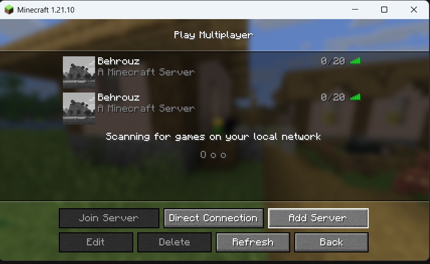

# Minecraft Docker Server

This repository contains a fully dockerized Minecraft Java Edition server.
The project is designed to run a Minecraft server inside a Docker container **without using any pre-built Minecraft images**, fulfilling all requirements o>

## Table of Contents

1. [Features](#1-features)
2. [Prerequisites](#2-prerequisites)
3. [Quickstart](#3-quickstart)
4. [Usage](#4-usage)
5. [Security & Secrets](#5-security--secrets)
6. [Entrypoint & Startup Logic](#6-Entrypoint--Startup-Logic)
7. [Customization & Mods](#7-customization--mods)
8. [Troubleshooting & Logs](#8-Troubleshooting--Logs)
9. [Notes & Design Decisions](#9-Notes--Design-Decisions)
10. [License](#10-license)

# Instructure

## 1. Features

### Main components
- **Dockerfile** → builds a custom Minecraft server image
- **docker-compose.yaml** → manages the Minecraft server container
- **Persistent volume** → stores world data and configuration

### Main purpose
To provide a clean, reproducible, and automated way to deploy a Minecraft server using Docker.

## 2. Prerequisites

- Docker
- Docker Compose
- Internet connection
- Open port **8888** on firewall or cloud provider

---
## 3. Quickstart

1. Clone the repository:

```bash
git clone https://github.com/behrouzRajaei/minecraft-docker-server-new.git
cd minecraft-docker-server-new
```

2. Create environment file:

Copy the example environment file and adjust values if needed:

```bash
cp .env.example .env
```
Edit the .env file and adjust the values if needed.

3. Start the Minecraft server:

```bash
docker-compose up -d --build
```
4. Verify the container is running:

```bash
docker ps
```
## 5. Connect from Minecraft Java Edition

Connect to the server using the IP address of the machine where Docker is running.

**Server address:**
<SERVER_IP>:8888

**Example (local setup):**
localhost:8888



---

## 4. Usage

### Environment configuration

All configuration values are defined in a `.env` file and injected into the container
via Docker Compose.

The following variables control the Minecraft server behavior:

| Variable        | Default  | Description                    |
|-----------------|----------|--------------------------------|
| EULA            | true     | Accept Minecraft EULA          |
| VERSION         | 1.21.1   | Minecraft server version       |
| MEMORY          | 2G       | JVM memory limit               |
| SERVER_PORT     | 25565    | Internal Minecraft port        |
| MAX_PLAYERS     | 20       | Maximum number of players      |
| DIFFICULTY      | normal   | Game difficulty                |
| ONLINE_MODE     | true     | Enable online mode             |

These variables can be adjusted to tune performance and gameplay behavior.

### Container lifecycle

Start the server:

```bash
docker compose up -d
```
Check container status:
```
docker ps
```
View server logs:
```
docker logs -f mc-server
```
Stop the server:
```
docker compose down
```

### Persistent data

The Minecraft world data is stored in a named Docker volume:

This ensures:
- World data persists across container restarts
- No direct bind mount from host to container is required
- The container remains isolated from the host filesystem
```
mc-world:/opt/minecraft/world
```

This ensures:

- World data is stored permanently

- Configuration is preserved

- Data remains after container restarts

### Restart behavior

The container is configured to automatically restart if it crashes:

```
restart: unless-stopped
```

---

## 5. Security & Secrets

- No credentials, passwords, or secrets are committed to this repository
- Configuration is provided exclusively via environment variables
- Sensitive values must be stored in a `.env` file (not committed)
- The repository provides a `.env.example` file as a template
- Hardcoded values inside `docker-compose.yaml` are avoided
- `.env` is excluded via `.gitignore`
- The `.env` file is intentionally excluded from version control and must not be committed.

This approach prevents leaking sensitive configuration and follows container security best practices.

## 6. Entrypoint & Startup Logic

The container uses a custom `ENTRYPOINT` defined in the Dockerfile to start the Minecraft server.

The entrypoint is responsible for:
- Launching the Fabric Minecraft server
- Applying JVM memory limits
- Running the server in headless mode (`nogui`)

### Entrypoint command

```dockerfile
ENTRYPOINT ["bash","-c","java -Xms${MEMORY_MIN} -Xmx${MEMORY_MAX} -jar fabric-server-launch.jar nogui"]
```
This approach ensures:
- Consistent startup behavior
- Environment-based configuration
- Automatic restart support via Docker Compose

## 7. Customization & Mods

This server uses **Fabric** as the mod loader.

### Installed mods

The following mods are included for customization and performance optimization:

1. **Fabric API** – Core dependency for Fabric mods
2. **Lithium** – Server-side performance optimization
3. **Sodium** – Rendering optimization (mainly client-side, included for compatibility)

All mods are stored inside the container at:

```
/opt/minecraft/mods
```

### Mod management

- Mods are copied into the image during build time
- Mods must match the Minecraft server version
- Version mismatches may prevent the server from starting

To add or remove mods:
1. Update the `mods/` directory
2. Rebuild the image using `docker compose build`

## 8. Troubleshooting & Logs

### View server logs

To inspect the Minecraft server output:

```bash
docker logs -f mc-server
```
#### Common issues

1. Server does not start
- Check Java version and mod compatibility

2. Client cannot connect
- Ensure the client Minecraft version matches the server version
- Confirm port 8888 is open and mapped correctly

3. Mods not loading
- Verify Fabric loader version
- Check mod compatibility with the server version

## 9. Notes & Design Decisions

- No pre-built Minecraft Docker images are used
- The image is built entirely from a base Ubuntu image
- Only one persistent volume is used for the Minecraft world
- No direct host filesystem access is required for server data
- Configuration is handled via environment variables
- The setup is designed to be reproducible and reviewable

## 10. License

This project is licensed under the **MIT License**.
See the [LICENSE](LICENSE) file for details.
You are free to use, modify, and distribute this project for educational and personal purposes.

> This README and repository are structured to provide a clean, technical, and professional setup for a Dockerized Minecraft server, suitable for GitHub or GitLab.
